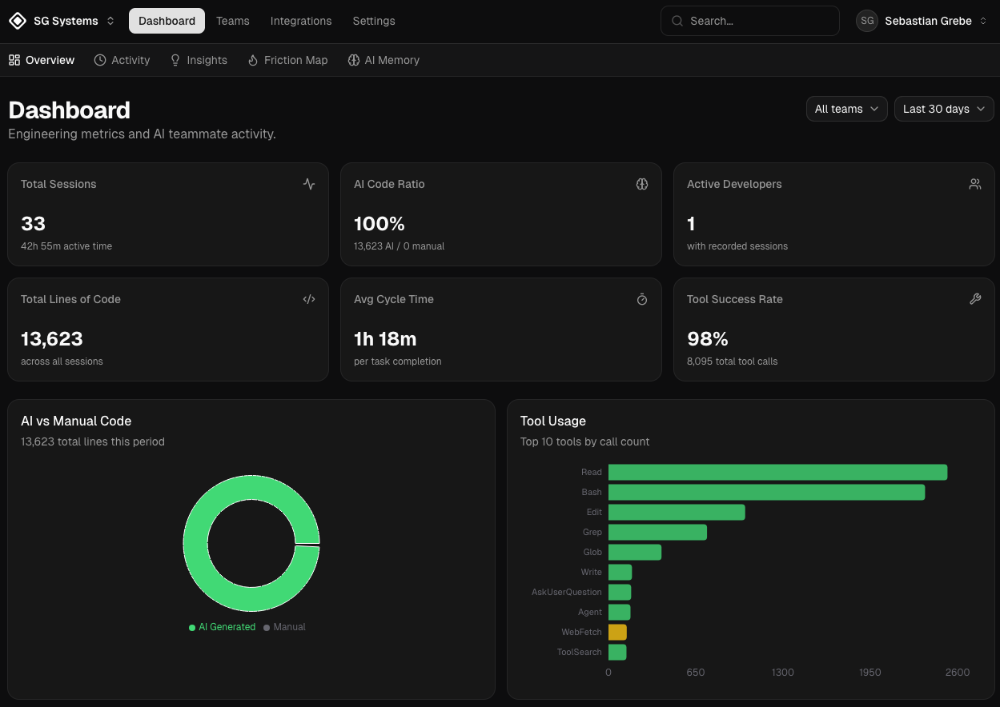

<p align="center">
  
</p>

<h1 align="center">Tandemu</h1>

<p align="center">
  <strong>An AI that remembers you. A team that sees everything.</strong>
</p>

<p align="center">
  The management layer for AI-assisted development.<br/>
  Persistent memory and telemetry for Claude Code and OpenCode — built for developers and engineering leads.
</p>

<p align="center">
  <a href="https://tandemu.dev">Website</a> · <a href="https://tandemu.dev/docs">Documentation</a> · <a href="https://app.tandemu.dev">Dashboard</a> · <a href="https://tandemu.dev/docs/self-hosting/overview">Self-Hosting Guide</a>
</p>

<br/>

<p align="center">
  
</p>

<br/>

## What is Tandemu?

Tandemu is an AI teammate platform that sits on top of [Claude Code](https://claude.ai/code) or [OpenCode](https://opencode.ai). It serves two audiences:

- **For developers** — a persistent AI companion that remembers your coding style, architectural decisions, and debugging history across sessions. Daily workflow is driven by slash commands (`/morning`, `/finish`, `/standup`).
- **For engineering leads** — non-invasive observability into AI-native development. Real metrics (AI ratio, cycle time, friction, DORA) replace estimation ceremonies like story points and manual timesheets.

## Key Features

| | Feature | Description |
|---|---|---|
| 🧠 | **Persistent Memory** | Retains coding styles, decisions, and context across sessions |
| 📊 | **Code Attribution** | Exact AI vs. manual split per commit via `Co-Authored-By` |
| ⏱️ | **Passive Time Tracking** | Automated session-based logging — no manual timesheets |
| 🔥 | **Friction Detection** | Surfaces tool failures and prompt loops as a heatmap |
| 📈 | **DORA Metrics** | Deployment frequency and lead time from task completions |
| 💰 | **ROI Analysis** | Productivity multipliers, cost-per-task, capacity freed |
| 🔒 | **Privacy-First** | Session-level metrics only — no keystrokes, screen recordings, or prompt content |

## Integrations

GitHub Issues · Linear · Jira · ClickUp · Asana · monday.com

## Quick Start

### Prerequisites

- [Docker](https://docs.docker.com/get-docker/) & Docker Compose
- [Node.js](https://nodejs.org/) 20+
- [pnpm](https://pnpm.io/) 9+

### 1. Start the stack

```bash
git clone https://github.com/sebastiangrebe/tandemu.git
cd tandemu
docker compose up -d
```

### 2. Connect your AI editor

Tandemu installs into any of: **Claude Code**, **OpenCode**, **Cursor**, **Codex CLI** — pick one or run them side by side. All four get the same skills (`/morning`, `/finish`, `/pause`, `/create`, `/standup`).

| Agent | Skill location | Memory MCP | Install |
|-------|----------------|------------|---------|
| Claude Code | Plugin marketplace + `~/.claude/skills/` | `~/.mcp.json` | `/plugin install tandemu` (in Claude) or `./install.sh --target=claude` |
| OpenCode | npm plugin + `~/.config/opencode/skills/` | `opencode.json` `mcp.tandemu-memory` | `./install.sh --target=opencode` |
| Cursor | `~/.cursor/commands/<name>.md` + `.cursor/rules/tandemu.mdc` | `~/.cursor/mcp.json` | `./install.sh --target=cursor` |
| Codex CLI | `~/.codex/prompts/<name>.md` + `~/.codex/AGENTS.md` | `~/.codex/config.toml` | `./install.sh --target=codex` |

**Claude Code (recommended):**

```bash
# In Claude Code:
/plugin marketplace add sebastiangrebe/tandemu
/plugin install tandemu
/tandemu:setup
```

**Any other agent — or multiple:**

```bash
git clone https://github.com/sebastiangrebe/tandemu.git
cd tandemu
./install.sh                           # auto-detects installed agents
./install.sh --target=cursor,codex     # explicit, comma-separated
./install.sh --target=all              # everything detected
```

The installer authenticates you (browser-based OAuth), drops the canonical `AGENTS.md` (or Cursor `.mdc` rule), copies the 6 skills as native slash commands into each agent's command directory, and registers the Tandemu memory MCP server. Skills source a universal env loader at `~/.config/tandemu/lib/tandemu-env.sh` so they run identically regardless of which agent invokes them.

Exit and reopen your editor, then start working:

```bash
/morning
```

The same five skills (`/morning`, `/finish`, `/pause`, `/create`, `/standup`) are available on all four agents, and `/finish` telemetry (lines, AI ratio, session duration) flows to the dashboard from every one. Invocation differs slightly per agent: Claude Code and OpenCode load them via their plugin marketplaces; Cursor runs them as custom commands (Agent mode, per-step shell approval — the SKILL.md `allowed-tools` frontmatter is a no-op there); Codex exposes them under its namespaced `/prompts:` mechanism. Functionally equivalent, not pixel-identical.

### 3. Development mode

For local development with hot reload:

```bash
docker compose -f docker-compose.yml -f docker-compose.dev.yml up
pnpm install   # IDE support
pnpm build     # Build all packages
```

## Architecture

```
apps/
  backend/        — NestJS API (PostgreSQL + ClickHouse)
  frontend/       — Next.js dashboard (shadcn/ui + Recharts)
  skills/         — Shared skills + AGENTS.md (used by both editor plugins)
  claude-plugins/ — Claude Code packaging (marketplace plugin)
  opencode-plugin/— OpenCode packaging (npm plugin: @sebastiangrebe/opencode-plugin)
  e2e/            — Playwright E2E tests
packages/
  types/          — Shared TypeScript types
  database/       — SQL migrations
```

| Service | Port | Purpose |
|---------|------|---------|
| frontend | 3000 | Next.js dashboard |
| backend | 3001 | NestJS API |
| postgres | 5432 | Relational data |
| clickhouse | 8123 | Telemetry analytics |
| redis | 6379 | Cache + job queues |
| otel-collector | 4317/4318 | OpenTelemetry ingestion |
| openmemory | 8765 | MCP memory server (Mem0) |
| mem0_store | 6333 | Qdrant vector store |

## How It Works

```
/morning  →  pick a task  →  work  →  /finish
```

1. **`/morning`** — Fetches tasks from your ticket system. Creates a git worktree with a feature branch.
2. **Work** — Code normally. Tandemu tracks session time, AI ratio, and friction in the background.
3. **`/finish`** — Measures work, sends telemetry, updates the ticket, creates a PR, and cleans up the worktree.

Each task runs in its own worktree, so you can work on multiple tasks in parallel across Claude Code sessions.

| Skill | Description |
|-------|-------------|
| `/morning` | Pick a task and start working |
| `/finish` | Complete task, measure work, send telemetry |
| `/pause` | Pause current task for later |
| `/create` | Create a new task in the ticket system |
| `/standup` | Generate a team standup report |

## Deployment

| | Option | Details |
|---|---|---|
| 🏠 | **Self-hosted** | Docker Compose — free and open-source |
| ☁️ | **Managed cloud** | [app.tandemu.dev](https://app.tandemu.dev) — $25/developer/month |

See the [self-hosting guide](https://tandemu.dev/docs/self-hosting/overview) for production deployment instructions.

## Documentation

Full documentation is available at **[tandemu.dev/docs](https://tandemu.dev/docs)**.

- [Installation & Setup](https://tandemu.dev/docs/setup)
- [Developer Workflow](https://tandemu.dev/docs/developer/workflow)
- [Memory System](https://tandemu.dev/docs/developer/memory)
- [Dashboard & Metrics](https://tandemu.dev/docs/lead/dashboard)
- [Self-Hosting Configuration](https://tandemu.dev/docs/self-hosting/configuration)

## Updating

### Claude Code (plugin marketplace)

```bash
/plugin marketplace update        # refresh the catalog (does NOT upgrade the plugin)
/plugin update tandemu@tandemu    # upgrade the installed plugin
/tandemu:setup                    # re-run to refresh ~/.claude/lib + ~/.config/tandemu/lib
```

Restart Claude Code after the update so skills + hooks reload. The `/tandemu:setup` re-run is what propagates new loader logic into `~/.claude/lib/tandemu-env.sh` and `~/.config/tandemu/lib/tandemu-env.sh`; skipping it leaves the old loader in place and any in-flight task files won't migrate. Updates only propagate when `plugin.json`'s `version` field changes.

### OpenCode (npm)

OpenCode resolves the plugin from npm via Bun. Update by re-resolving:

```bash
bun update @sebastiangrebe/opencode-plugin
```

Or restart `opencode` if you're tracking a floating semver range.

### install.sh users (any editor)

```bash
cd tandemu && git pull
./install.sh --check              # see installed vs latest for each target
./install.sh                      # auto-detect targets and update in place
./install.sh --target=all         # update every detected agent
./install.sh --target=cursor      # single-agent update
```

`pnpm release` bumps the version across `apps/claude-plugins/.claude-plugin/plugin.json`, `.claude-plugin/marketplace.json`, and `apps/opencode-plugin/package.json` simultaneously. The MCP-first targets (Cursor, Copilot, Codex) track the same plugin version for `--check` reporting.

## Uninstalling

```bash
./install.sh --uninstall          # preferred: cleans config, skills, MCP, cache
```

For a full clean-slate reset, see [UNINSTALL.md](UNINSTALL.md). The plugin can also be removed via `/plugin uninstall tandemu@tandemu` in Claude Code.

## License

[Elastic License 2.0 (ELv2)](LICENSE) — free to use and self-host, but you may not offer it as a competing hosted service.
